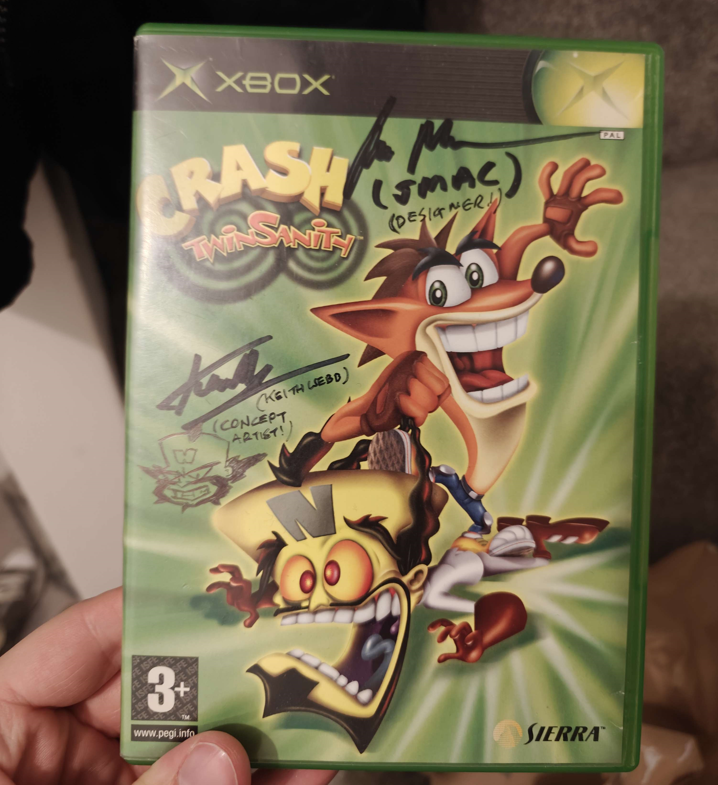

I recently had the pleasure of getting in touch with [John McCann](https://jmac.co/), the designer for one of my all time favourite games, Crash Twinsanity. 
He and the concept artist [Keith Webb](https://x.com/webbstawebb) kindly agreed to sign my childhood copy of the game! How about that! Keith even drew a little Cortex
sketch to go with his signature:

The two of them have been releasing all sorts of interesting information regarding the development of the game on [their youtube channel](https://www.youtube.com/@JMac1980/videos). If you are not familiar with the title and its history, it unfortunately had a number of issues during production and was ultimately released with quite a lot of content cut out, most notably the level "Gone a bit coco" which was apparently very close to completion. A very short clip of the level is all that seemingly remains, but who knows what might surface one day...
If you are as mad about Twinsanity as I am, or you just really like crash bandicoot, go check them out!
