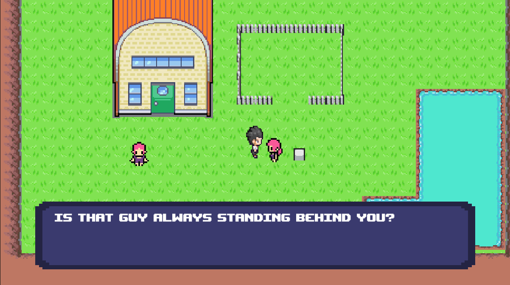

Since mid 2020 I've been messing around with Unity (and a little bit of gamemaker) on and off without too much direction. I've created a number of small projects, none of which ever reached a point I was happy with (with the exception of one which I cannot yet reveal), mostly due to me having ideas that were far too grand for what I could make at the time. I've spent some time looking through my old projects folder and decided that the projects below were worth sharing.

## #1: Third person fall of cybertron shooter
I think this is the prototype I spent the most time on. Codenamed Astray, myself and a good friend of mine had been spitballing ideas for some time about a game that played similarly to something like Transformers: Fall of Cybertron as we felt their hadn't been a similar game of that caliber for some time. It would've taken inspiration from Transformers, Bionicle, and probably Gundam too. While I didn't have a huge amount of trouble programming many parts of the prototype thanks to my background in maths, I lacked the artistic ability and my friend unfortunately didn't have the time to cover me in that department, despite his skills. The end result is the main character just being a purple guy until one of us could figure out what our main character was going to look like.

<iframe 
width="560" 
height="315"
rel=0 
modestbranding=1 
src="https://www.youtube.com/embed/6suaHop70Yo?si=TkT24kn5G_I31HMc" 
title="YouTube video player" 
frameborder="0" 
allow="autoplay; encrypted-media" 
referrerpolicy="strict-origin-when-cross-origin" 
allowfullscreen></iframe>

## #2: MechGame (GameMaker Studio 2)
A bullet hell game which was centred around playing as a mech which had the ability to remove layers of armour in exchange for movement speed. Unfortunately due to a problem with my gamemaker account I currently can't open the project, but I do have a small amount of footage as well as some sprites that me and my friend made. The mech honestly ended up looking and moving more like a spaceship, which was made worse due to it being top down. I still kinda like the sprite though!

<iframe 
width="560" 
height="315"
rel=0 
modestbranding=1 
src="https://www.youtube.com/embed/3owJN2bn0fE?si=SDbeaRmsVKX7PNSu" 
title="YouTube video player" 
frameborder="0" 
allow="autoplay; encrypted-media" 
referrerpolicy="strict-origin-when-cross-origin" 
allowfullscreen></iframe>

## #3: Bullet Hell RPG
To be honest I don't fully remember what I had in mind for this project. I was playing a lot of touhou and I think Pokemon at the time, and thought it would be really cool to make an RPG where the battles are bullet hell fights. I spent some time wiring up some free sprite sheets for the player and environment, creating the little map you see below.

<iframe 
width="560" 
height="315"
rel=0 
modestbranding=1 
src="https://www.youtube.com/embed/1ybeI5s40vc?si=Y8nAqdKlMr0Vzzm3" 
title="YouTube video player" 
frameborder="0" 
allow="autoplay; encrypted-media" 
referrerpolicy="strict-origin-when-cross-origin" 
allowfullscreen></iframe>

 

The one NPC I made had some very ominous words for me...

I also started prototyping the battle arena. The robed fellow and the fireball are sprites created by me. I tried to make a system where damage was dealt to the boss upon deflecting one of the special blue fireballs. I think past me would've really benefitted from knowing about object pooling for this one...

<iframe 
width="560" 
height="315"
rel=0 
modestbranding=1 
src="https://www.youtube.com/embed/mxXFW7QAYKA?si=qdd2iKAcqcK8bCXm" 
title="YouTube video player" 
frameborder="0" 
allow="autoplay; encrypted-media" 
referrerpolicy="strict-origin-when-cross-origin" 
allowfullscreen></iframe>

## #4: Touhou Clone
Also created at a similar time to the rpg bullet hell above, my obsession with Touhou also led me to try and recreate Embodiment of Scarlet Devil from scratch. I imagine I left this one due to how long it would've taken to accurately recreate the game...

<iframe 
width="560" 
height="315"
rel=0 
modestbranding=1 
src="https://www.youtube.com/embed/q_4QiMOWXyU?si=PRft748Go5--QumJ" 
title="YouTube video player" 
frameborder="0" 
allow="autoplay; encrypted-media" 
referrerpolicy="strict-origin-when-cross-origin" 
allowfullscreen></iframe>

## #5: Coming soon!
I can't say anything about this one yet, but I've been hard at work on a project which has actually reached a very high level of polish. It's a love letter to the community for one of my favourite games, and I'm so excited to release it. Shouldn't be too much longer, stay tuned!

If there's one lesson I've learned from working on all of these and doing a sort of "post-mortem" in the process of writing this, it's that you really should start with small projects when trying to get into game dev. Set plenty of clear milestones that seem achievable on their own, that way you can celebrate each time you hit one and help keep that momentum going. And most importantly, believe in yourself! Lots of things are going to seem out of reach especially when you start, it's amazing what you can learn in just a short space of time if you stick with it. People overestimate what they can do in a day, but underestimate what they can achieve in a year. Maybe if I start taking my own advice I'll have a really cool game to show off in this blog one day!
