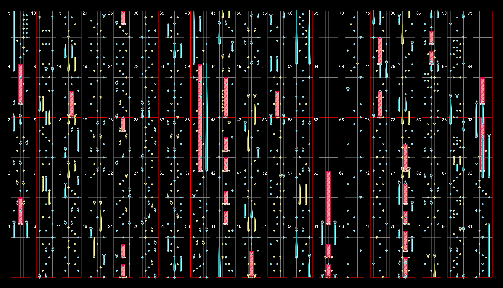

Another project which I did actually finish for the Museca community was a chart image generator. Many rhythm games have this feature, but due to the game's relative obscurity, nobody ever took the time to work on one for museca. At the time I was already heavily involved with the development of [Museca Plus](https://museca.plus/), a continuation mod for Museca, so I decided to put my skills to good use and make some stuff that both the dev team and community could benefit from. You can see many examples of the program's output [here](https://museca.plus/charts/16). 

I am still quite involved in the development of the modpack, and have every intention of developing more great tools for the museca community in the near future. Stay tuned!